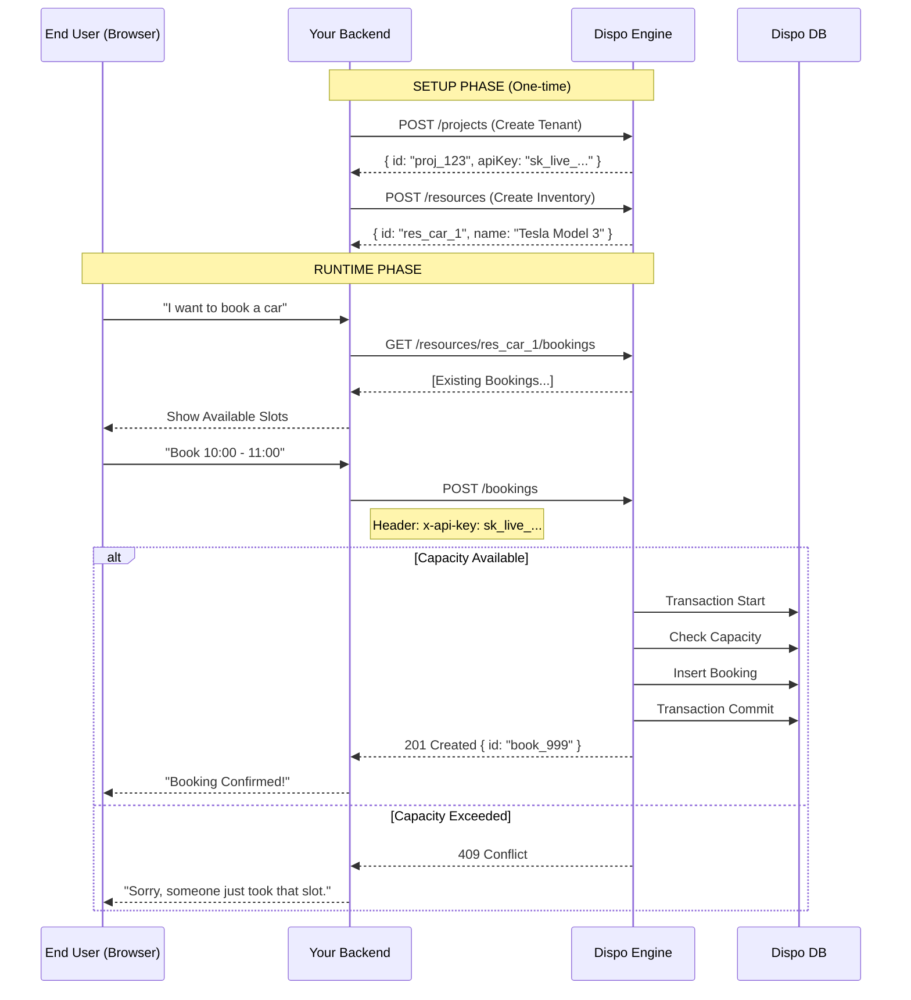

# DEVELOPER EXPERIENCE (DX) GUIDE

## 1. PHILOSOPHY: THE HEADLESS BOOKING KERNEL

**dispo.now** is a "Booking Kernel". It is designed to be the invisible engine behind your custom application.
*   **You build the UI**: The calendar, the booking form, the payment flow.
*   **We handle the Logic**: Availability, Capacity, Concurrency, and Validation.

It acts as a microservice that you consume via REST API.

---

## 2. INTEGRATION FLOW

### SDK Support

We provide an official Node.js SDK to simplify integration:

```bash
npm install @riv0manana/dispo-now-sdk
```

### Phase 1: Onboarding (Management)
**Context**: Your Backend / Admin Panel
**Auth**: `Bearer Token`

1.  **Create a User**: You (the developer) create an admin account.
2.  **Create a Project**: Represents a "Tenant" or "Context" in your app.
    *   *Result*: You receive an `apiKey`. Save this! It is the key to the Runtime API.

### Phase 2: Inventory (Configuration)
**Context**: Your Backend / Admin Panel
**Auth**: `x-api-key` (or Bearer)

1.  **Define Resources**: Create entities that can be booked.
    *   Set `defaultCapacity` (e.g., 1 for a room, 20 for a class).
    *   Set `bookingConfig` (Operating hours: 9am-5pm).

### Phase 3: Runtime (Consumption)
**Context**: Your Frontend / Mobile App / Integration
**Auth**: `x-api-key`

1.  **Check Availability**: Query bookings for a resource.
2.  **Create Booking**: Submit a booking request.
    *   The engine validates: *Is it open? Is there capacity?*
    *   If **Yes**: Returns `201 Created`.
    *   If **No**: Returns `409 Conflict`.

---

## 3. ARCHITECTURE & FLOW



---

## 4. INTEGRATION SCENARIOS

### Scenario A: Car Rental (Individual Booking)
**Use Case**: A user rents a specific car for a specific time range.
*   **Pattern**: Single Resource, Capacity = 1.

**Setup**:
```json
// POST /resources
{
  "name": "Tesla Model 3 #42",
  "defaultCapacity": 1,
  "metadata": { "plate": "ABC-123", "location": "NYC-Hub" }
}
```

**Booking**:
```json
// POST /bookings
{
  "resourceId": "res_tesla_42",
  "start": "2024-06-01T10:00:00Z",
  "end": "2024-06-03T10:00:00Z",
  "quantity": 1
}
```

### Scenario B: Healthcare (Atomic Group Booking)
**Use Case**: A medical appointment requires **both** a Doctor AND a Treatment Room simultaneously. If one is unavailable, the booking must fail.
*   **Pattern**: Group Booking (Atomic Transaction).

**Setup**:
1.  Resource: `Dr. Smith` (Capacity 1)
2.  Resource: `Room 101` (Capacity 1)

**Booking**:
```json
// POST /bookings/group
{
  "projectId": "proj_hospital_A",
  "bookings": [
    {
      "resourceId": "res_dr_smith",
      "start": "2024-06-01T14:00:00Z",
      "end": "2024-06-01T14:30:00Z",
      "quantity": 1
    },
    {
      "resourceId": "res_room_101",
      "start": "2024-06-01T14:00:00Z",
      "end": "2024-06-01T14:30:00Z",
      "quantity": 1
    }
  ]
}
```
*Result*: Returns `201` only if **both** are free. Prevents "orphaned" bookings (e.g., booked room but no doctor).

### Scenario C: Digital Course (High Capacity)
**Use Case**: A live webinar that can accept up to 50 students.
*   **Pattern**: Single Resource, High Capacity.

**Setup**:
```json
// POST /resources
{
  "name": "Intro to React Webinar",
  "defaultCapacity": 50,
  "bookingConfig": {
    "daily": { "start": "18:00", "end": "20:00" } // Only evenings
  }
}
```

**Booking**:
```json
// POST /bookings
{
  "resourceId": "res_webinar_01",
  "start": "2024-06-10T18:00:00Z",
  "end": "2024-06-10T20:00:00Z",
  "quantity": 1
}
```
*Note*: The engine automatically tracks how many spots are left (50 -> 49 -> ... -> 0).

### Scenario D: SaaS Platform (Multi-Tenant)
**Use Case**: You are building "SalonManager Pro", a SaaS for hair salons. Each Salon is a customer of yours.
*   **Pattern**: Project per Tenant.

**Workflow**:
1.  **New Signup**: When "Salon A" signs up for your SaaS:
    *   You call `POST /projects` -> Name: "Salon A".
    *   Save the returned `apiKey` in your database associated with "Salon A".
2.  **Resource Creation**: When Salon A adds a "Stylist":
    *   You call `POST /resources` using **Salon A's API Key**.
3.  **Booking**: When a customer books Salon A:
    *   You call `POST /bookings` using **Salon A's API Key**.

*Benefit*: Data is completely isolated. Salon A cannot see Salon B's bookings.

---

## 5. BEST PRACTICES

### 1. Idempotency & Metadata
Always link bookings back to your system using `metadata`.
```json
{
  "metadata": {
    "mySystemOrderId": "ord_888",
    "stripePaymentId": "pi_123"
  }
}
```
This allows you to reconcile data if needed.

### 2. Timezones
**dispo.now** is timezone-agnostic. It strictly compares ISO 8601 timestamps.
*   **Recommendation**: Always convert to **UTC** before sending to the API.
*   Display in Local Time in your UI.

### 3. Error Handling
*   **409 Conflict**: This is a "business logic" state, not a system error. It means "Sold Out". Handle it gracefully in your UI (e.g., "Slot taken, please pick another").
*   **400 Bad Request**: Usually invalid time range (Start > End) or validation failure.

### 4. Security
*   **Never expose the Bearer Token** in your frontend code. It allows creating/deleting projects.
*   **API Key** is scoped to the Project. It is safer but still allows creating/cancelling bookings. Ideally, proxy requests through your own backend to enforce your own user permissions (e.g., "Can this user book this resource?").
